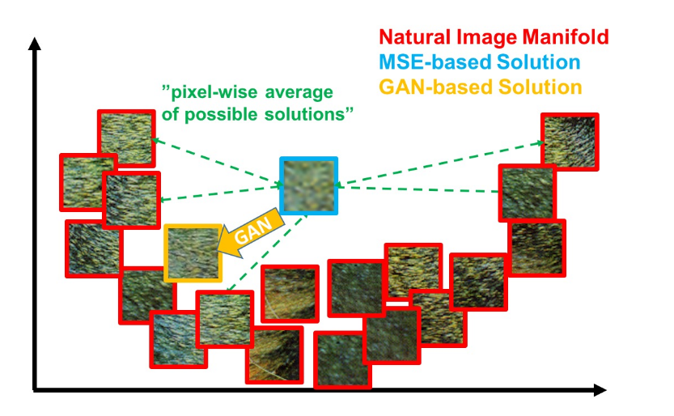
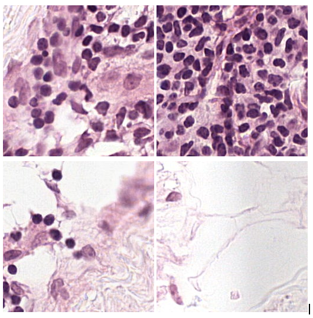
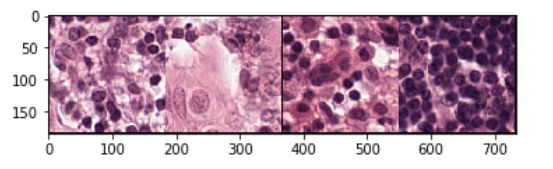
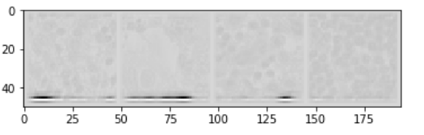
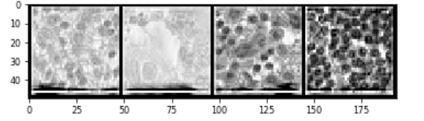
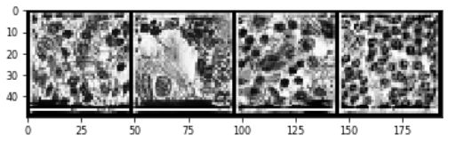
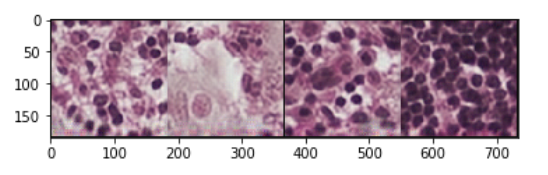

# mscopy-AE

## Precursors

### Super Resolution and Generative Adversarial Networks
Super resolution refers to the technique where we try to get the high resolution version of the data (typically images) from the low resolution version (which may be noisy or corrupted). The classical techniques of obtaining higher resolution versions based on interpolation such as Bilinear and Bicubic methods fails miserably, that is in many of the critical use cases such high resolution version obtained can not be used as the image obtained is usually distorted. Recent developments in Deep Learning has made it possible to tackle this problem from an Optimization perspective using deep neural nets. Even more recently with the introduction of Generative Adversarial Networks (GANs), the super resolution versions of the images are demonstrated to be far more accurate than any of the previously known methods. One such deep learning method proposed is **[Photo-Realistic Single Image Super-Resolution Using a Generative Adversarial Network](https://arxiv.org/abs/1609.04802)** (refered to as SRGAN)

The idea of the above proposed model is to use adversarial loss and training instead of some standard loss functions used before such as MSE as such loss functions would lead to optimal images which sure have low MSE but visually blurry (not in the natural manifold of images). The adversarial training nudges the *Generator* towards natural manifold of images, hence the output is visually more appealing.

One of the main features of the above proposed method is it's *loss-function* in addition of minimizing the MSE between the pixel values of the original High resolution image and the "super-resoluted" image (the standard method), they also take into account the MSE between some feature space (like output of VGG network from some intermediate layer), and also an additional term representing the *GAN* loss function (**note that the paper uses the standard flavor of GAN not the Wasserstein-GAN**)

## Motivation
Super resolution is quite relevant in the field of medical imaging and a hot topic of research currently. To get started, I decided to do super resolution on some medical images (*very simple, right? just change the dataset and retrain the model*)

## Gotcha
* Not that simple. The original SRGAN uses uses the features extracted from ***pre-trained*** VGG network, pre-trained on ***Natural Images*** (ImageNet to be precise). And guess what? ImageNet doesn't have microscopy images, or CTs or MRIs etc. We can't expect it to work for medical images out of the box.

## Why does this repo exist?
I decided to test the idea on some medical images (read [CAMELYON 16](https://camelyon16.grand-challenge.org/)). This consists of ***hematoxylin and eosin (H&E) stained whole-slide images*** the original purpose of the dataset was to train models for automatic detection of medical conditions. The dataset consists of high resolution images ( yay! exactly what we need for training a network performing super resolution ). Some sample cropped patches from the dataset looks like

This repo serves as the code base for an **auto-encoder network** which I can use in my super resolution network to perform super resolution for this dataset. Remember the VGG loss term mentioned above, this is to replace that loss term.

## Something about the architecture
The Encoder and Decoder are like mirror images of each other. Encoder consists of Convolutional layers separated by the residual blocks, Decoder consists of the similar pattern in reverse order with Convolutinal Transpose layer instead of Convoutional ( it is also known by Deconvolution, which is sad misnomer )
The guiding principle for me in the design of the autoencoder was one that it should be able to produce encodings which lie in much lower dimensions compred to original image while still capable of capturing fine details so that the taking MSE loss between these encodings actually help the SRGAN network to learn something meaniningfull and help it to generate super resolution version with fine details.

## Results so far
This is still under-development as I continue exploring different concepts and tweaks to get better results, at this stage the results of encoder and decoder are as follows :

The input batch looks like (each image is `3X181X181` dimensional)

I forced the encodings to be one channel output so that I can visualise it as image
The encodings look like (each encoding is `1X46X46` dimensional)

For better visualisation, the *linear contrast* and *histogram eqalisation* leads to

Intrestingly the features do resemble the input images.

The output batch looks like (each image is `3X181X181` dimensional)

## What's going on right now?
This module is to be integrated with [my implementation of SRGAN and modified SRGAN like networks](https://github.com/udion/srgan_pilot) module to look at the final results of the super resolution. Stay tuned!